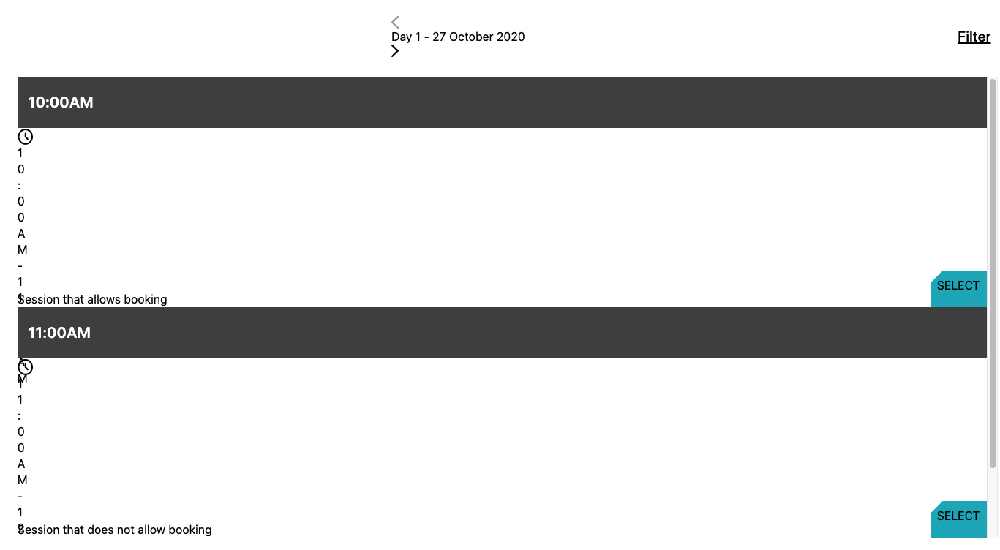
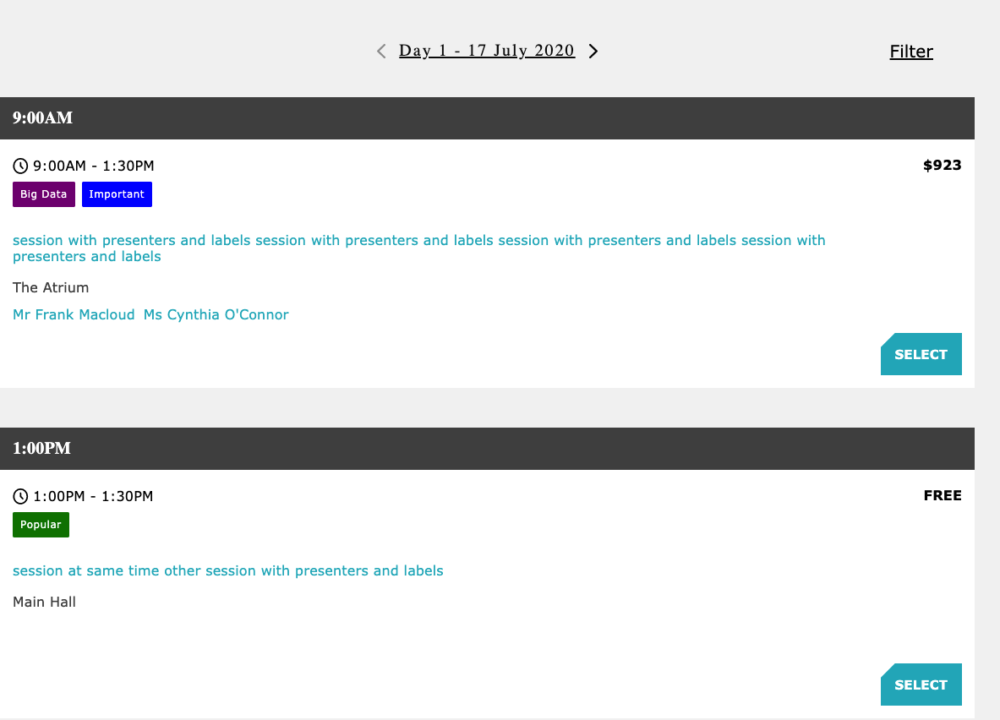

## Overview
* events force used `create-react-app` version `3.0.1` to initialize their app back in July 2019
* by using this same version, we were able to recreate the style problems the events-force team has had when consuming `tap-events-force`
* this readme and repo provide instructions for fixing this problem

## Problem
* when we setup a `create-react-app` app using version `3.0.1 `, the styles are wrong:
    - 

* however, when we upgrade the `react-scripts` dependency to version `3.1.0`, the problem is resolved:
  - 
  
* so the problem is that the configuration in `v3.0.1` is outdated, and the [changes introduced in v3.1.0](https://github.com/facebook/create-react-app/releases/tag/v3.1.0) fix it

## Solution
* in a non-ejected app, upgrading the version of `react-scripts` to at least `3.1.0` fixes the problem,
* since the events-force app is already ejected, we have setup this repo to provide a diff between versions `v3.1.0` and `v3.0.1` of an ejected app
* if you cannot return to a pre-ejected state with an updated `react-scripts`, we recommend updating the affected files and dependencies by following these steps:
1. `git clone https://github.com/daniel112/cra-3.0.1-to-3.1.0.git`
2. `cd cra-3.0.1-to-3.1.0/`
3. Open the repo in `vscode`
4. Open the following files in `vscode`:
* `package.json`
* `config/modules.js`
* `config/webpack.config.js`
* `scripts/test.js`
5. For each of those files, view the conflicts in `vscode` to see the changes between `HEAD` (v3.0.1) and the incoming changes (v3.1.0), to learn the modifications you'll need to make to your ejected files
